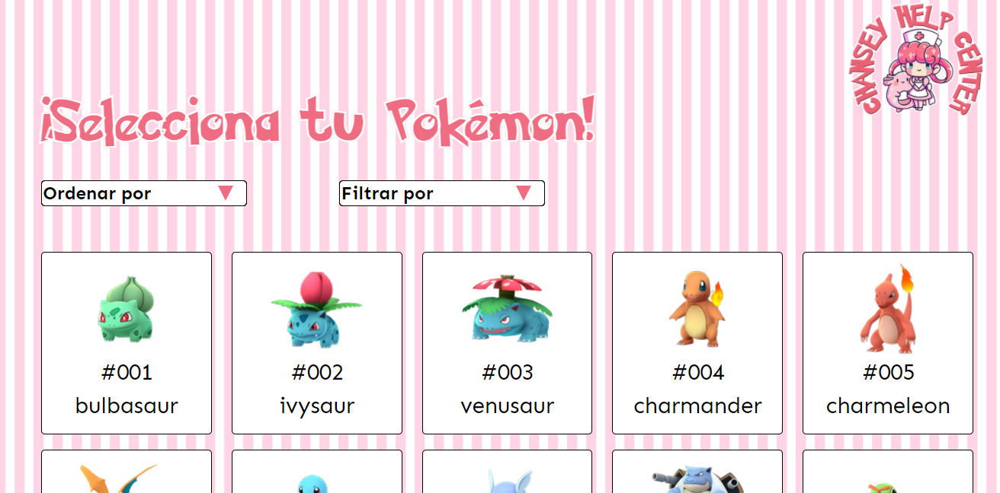

<!DOCTYPE html>
<html>
  <head>
    <meta charset="utf-8">
    <meta name="viewport" content="width=device-width">
    <link href="style.css" rel="stylesheet" type="text/css" />
  </head>
  <body>
    <h1>Chansey Help Center</h1>
    
¡Hola! Te presento la pagina "Chansey Help Center", una pagina creada para aquellos experimentados jugadores de Pokemon Go los cuales buscan identificar a los mejores pokemons para utilizar en sus equipos de batalla y/o encontrar informacion  para fortalecerlos. Esta pagina web te mostrara de forma amigable distintos tipos de datos que tienen cada uno de los pokemons, como por ejemplo, contra quien es fuerte y debil, sus estadisticas base, sus evoluciones, informacion acerca de los caramelos, huevos y habilidades cargadas y especiales.

    
    <h2>Historias de usuario</h2>
    
A continuacion se presentan las historias de usuarios creadas a partir de la identificacion de necesidades y/o problemas de nuestro jugador de Pokemon Go.

    
    <h2>Sketch</h2>
    
A travez de las historias de nuestros usuarios se comenzo a trabajar en el prototipado en papel de nuestro proyecto, este lo podemos ver a continuacion: 

    
    
    <h2>Prototipo de alta fidelidad</h2>
    
Luego de trabajar en nuestro prototipo de baja fidelidad comenzamos a trabajar en Figma para comenzar a iterar en relacion de lo que nos decian nuestros usuarios.

    
    
    
    
    <h2>Feedback</h2>
    
Al realizar el testeo con el prototipo de Figma nos presentaron los sientes feedback:
      <ul>
        <li>Modificar algunas expresiones tales como "Ataque especial".</li>
        <li>Mejorar la estructura de la pagina, respetar margenes.</li>
        <li>En la parte donde se muestran los detalles del Pokemon, mover todo el contido hacia arriba para que se pueda ver mas continido inmediato cuando uno hace click en la tarjeta.</li>
      </ul>
    <h2>Producto final</h2>
    
    
    
    
    
    
    

  </body>
</html>